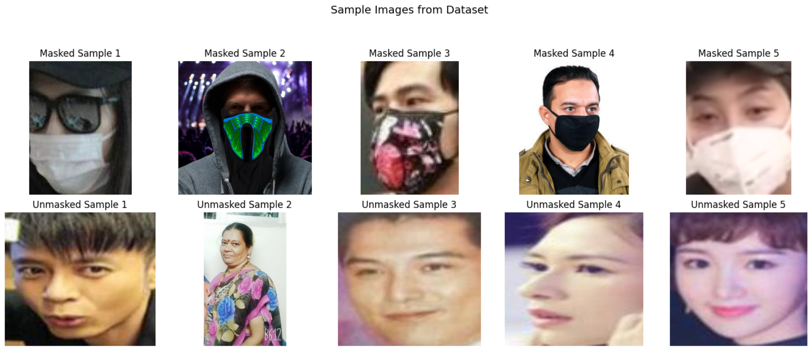

# VR_Project1_RishitaPatel_MS2024016
 
## Introduction

This project implements a computer vision system to address two key tasks:

### 1. Binary Classification
Predicts whether a person is wearing a face mask using:
- **Traditional Machine Learning**  
  - SVM with handcrafted features (HOG, LBP, color histograms)
  - Neural Network
- **Deep Learning**  
  - Custom CNN architectures with hyperparameter optimization

### 2. Mask Segmentation
Identifies the exact mask region using:
- **Traditional Image Processing**  
  - Thresholding and edge detection techniques
- **Deep Learning**  
  - U-Net model for pixel-wise segmentation


# Face Mask Classification Dataset
#### File Structure
```
VR_Project1/
└── Classification/
├── Dataset/
│ ├── with_mask/ # 2165 masked faces images
│ │ ├── masked_1.jpg
│ │ └── ...
│ └── without_mask/ # 1930 unmasked faces images
│ ├── unmasked_1.jpg
│ └── ...
│
├── Images/
│ ├── test1.jpeg
│ ├── test2.jpeg
│ ├── data_distribution.png
│ ├── donut_chart.png
│ ├── sample_images.png
│ └── ...
│
├── Models/
│ ├── cnn_classification.h5 # Trained CNN model
│ └── svm_model.pkl # Trained SVM model
│
└── Notebooks/
├── Dataset.ipynb
├── Handcrafted.ipynb
└── CNN.ipynb
```
## Dataset
Sample Images from the dataset:


Dataset distribution:


#### Source
[](https://github.com/chandrikadeb7/Face-Mask-Detection/tree/master/dataset) 


## Methodology
#### 1. Data Acquisition and Preprocessing:  
   - *Dataset Cloning:* The dataset is cloned from the [Face-Mask-Detection GitHub repository](https://github.com/chandrikadeb7/Face-Mask-Detection.git) and moved locally.  
   - *Data Loading:* The load_data() function loads images from two classes ("with_mask" and "without_mask") and resizes them to a fixed dimension (128×128). The images are converted into numpy arrays and labeled accordingly.
   - *Data Splitting:* The dataset is split into training, validation, and test sets, maintaining class stratification to preserve the distribution of classes across the splits.
   
#### 2. Handcrafted Feature Extraction:  
   - For each image, a set of handcrafted features is extracted:
     - *Edge Density:* Uses the Canny edge detector to capture the density of edges.
     - *Local Binary Pattern (LBP):* Computes texture features from the grayscale image.
     - *Color Histogram (HSV):* Represents color distribution by converting the image to the HSV color space.
     - *Histogram of Oriented Gradients (HOG):* Captures shape and structure information.
     - *Skin Segmentation (YCbCr):* Computes the skin segmentation ratio in the YCbCr color space.
   - These features are concatenated into a single feature vector for each image.

#### 3. Feature Normalization: 
   - The concatenated features are normalized using a StandardScaler to standardize the input data for the classifiers.

#### 4. Model Training and Evaluation: 
   - SVM Classifier:
     - An SVM with an RBF kernel is trained using GridSearchCV to tune hyperparameters (C and gamma).
     - The classifier is configured with probability estimates to facilitate ROC curve generation.
   - Neural Network Classifier:
     - A feedforward neural network (MLP) is defined with an input layer matching the feature vector dimension (1085), followed by hidden layers with ReLU activation, and a final sigmoid output layer for binary classification.
     - The network is trained using binary cross-entropy loss and the Adam optimizer.
   - Evaluation Metrics:
     - Both classifiers are evaluated using confusion matrices, overall metrics (accuracy, precision, recall, and F1-score), and ROC-AUC curves to assess their performance.

#### 5. Model Saving:  
   - The trained models (SVM and Neural Network) along with the scaler are saved for later inference or deployment.


