# VR Project1 by: RishitaPatel_MS2024016, AnweshNayak_MS20224003, AshashreeSarma_MS2024005
 
## Introduction

This project implements a computer vision system to address two key tasks:

### 1. Binary Classification
Predicts whether a person is wearing a face mask using:
- **Traditional Machine Learning**  
  - Support Vector Machine (SVM) with handcrafted features (HOG, LBP, color histograms)
  - Neural Network based classifier
- **Deep Learning**  
  - Custom Convolutional Neural Network (CNN) architectures with hyperparameter optimization

### 2. Mask Segmentation
Identifies the exact mask region using:
- **Traditional Image Processing**  
  - Otsu's Thresholding
  - Adaptive Thresholding
  - Watershed Algorithm
  - GrabCut Algorithm
  - K-means Clustering
- **Deep Learning**  
  - U-Net model 


# Face Mask Classification 
#### File Structure
```
VR_Project1/
└── Classification/
├── Dataset/
│ ├── with_mask/ # 2165 masked faces images
│ │ ├── masked_1.jpg
│ │ └── ...
│ └── without_mask/ # 1930 unmasked faces images
│ ├── unmasked_1.jpg
│ └── ...
│
├── Images/
│ ├── test1.jpeg
│ ├── test2.jpeg
│ ├── data_distribution.png
│ ├── donut_chart.png
│ ├── sample_images.png
│ └── ...
│
├── Models/
│ ├── cnn_classification.h5 # Trained CNN model
│ └── svm_model.pkl # Trained SVM model
│
└── Notebooks/
├── Dataset.ipynb
├── Handcrafted.ipynb
└── CNN.ipynb
```
## Dataset
Sample Images from the dataset:


Dataset distribution:


#### Source
[](https://github.com/chandrikadeb7/Face-Mask-Detection/tree/master/dataset) 


## Methodology

### Handcrafted Features and ML Classifiers
#### 1. Data Acquisition and Preprocessing:  
   - *Dataset Cloning:* The dataset is cloned from the [Face-Mask-Detection GitHub repository](https://github.com/chandrikadeb7/Face-Mask-Detection.git) and moved locally.  
   - *Data Loading:* The load_data() function loads images from two classes ("with_mask" and "without_mask") and resizes them to a fixed dimension (128×128). The images are converted into numpy arrays and labeled accordingly.
   - *Data Splitting:* The dataset is split into:
     - Training set: 64% of data
     - Validation set: 16% of data
     - Test set: 20% of data
     The split maintains class stratification to ensure the distribution of classes is preserved in each set.
   
#### 2. Handcrafted Feature Extraction:  
   - For each image, a set of handcrafted features is extracted:
     - *Edge Density:* Uses the Canny edge detector to capture the density of edges.
     - *Local Binary Pattern (LBP):* Computes texture features from the grayscale image.
     - *Color Histogram (HSV):* Represents color distribution by converting the image to the HSV color space.
     - *Histogram of Oriented Gradients (HOG):* Captures shape and structure information.
     - *Skin Segmentation (YCbCr):* Computes the skin segmentation ratio in the YCbCr color space.
   - These features are concatenated into a single feature vector for each image.

#### 3. Feature Normalization: 
   - The concatenated features are normalized using a StandardScaler to standardize the input data for the classifiers.

#### 4. Model Training and Evaluation: 
   - SVM Classifier:
     - An SVM with an RBF kernel is trained using GridSearchCV to tune hyperparameters (C and gamma).
     - The classifier is configured with probability estimates to facilitate ROC curve generation.
   - Neural Network Classifier:
     - A feedforward neural network (MLP) is defined with an input layer matching the feature vector dimension (1085), followed by hidden layers with ReLU activation, and a final sigmoid output layer for binary classification.
     - The network is trained using binary cross-entropy loss and the Adam optimizer.
   - Evaluation Metrics:
     - Both classifiers are evaluated using confusion matrices, overall metrics (accuracy, precision, recall, and F1-score), and ROC-AUC curves to assess their performance.

#### 5. Model Saving:  
   - The trained models (SVM and Neural Network) along with the scaler are saved for later inference or deployment.

### CNN (Convolutional Neural Networks)

#### **1. Data Acquisition and Preprocessing:**
   - **Dataset Cloning:**  
     The dataset is cloned from the Face-Mask-Detection GitHub repository and stored locally.
   
   - **Data Loading:**  
     The `load_data()` function loads images from two classes ("with_mask" and "without_mask"), resizes them to 128×128 pixels, and converts the images into numpy arrays. Each image is labeled as either `0` (with mask) or `1` (without mask).
   
   - **Data Splitting:**  
     The dataset is split into:
     - **Training set:** 64% of the data
     - **Validation set:** 16% of the data
     - **Test set:** 20% of the data  
     The split ensures class stratification to maintain the distribution of classes across the sets.

#### **2. Data Augmentation:**
   - **Training Data Augmentation:**  
     A `ImageDataGenerator` is used to apply several augmentation techniques on the training images, including:
     - Rotation range: 20°
     - Width and height shift ranges: 0.2
     - Shear range: 0.2
     - Zoom range: 0.2
     - Horizontal flip: Random flipping of images
     These augmentations help create diversity in the training data, reducing overfitting.
   
   - **Validation and Test Data Augmentation:**  
     The validation and test data are rescaled by a factor of 1./255 to normalize pixel values to the range [0, 1] for evaluation.

#### **3. CNN Architecture:**
   The model architecture is built using a **Sequential** model with the following layers:
   - **Convolutional Layers:**  
     Several `Conv2D` layers are stacked with increasing filters (32, 64, 128, 256, 512, 1024) and a kernel size of 3x3 or 5x5. These layers learn spatial features from the images.
   - **MaxPooling Layers:**  
     After each convolutional layer, a `MaxPooling2D` layer is added to reduce the spatial dimensions (downsampling), while retaining the important features.
   - **Dropout:**  
     Dropout layers (with a rate of 0.5) are used after fully connected layers to prevent overfitting during training.
   - **Fully Connected Layers:**  
     The output of the convolutional layers is flattened and passed through fully connected layers with **ReLU**, **Tanh**, or **SELU** activation functions to introduce non-linearity.
   - **Output Layer:**  
     The final output layer has a **sigmoid** or **tanh** activation function for binary classification (mask/no mask).
     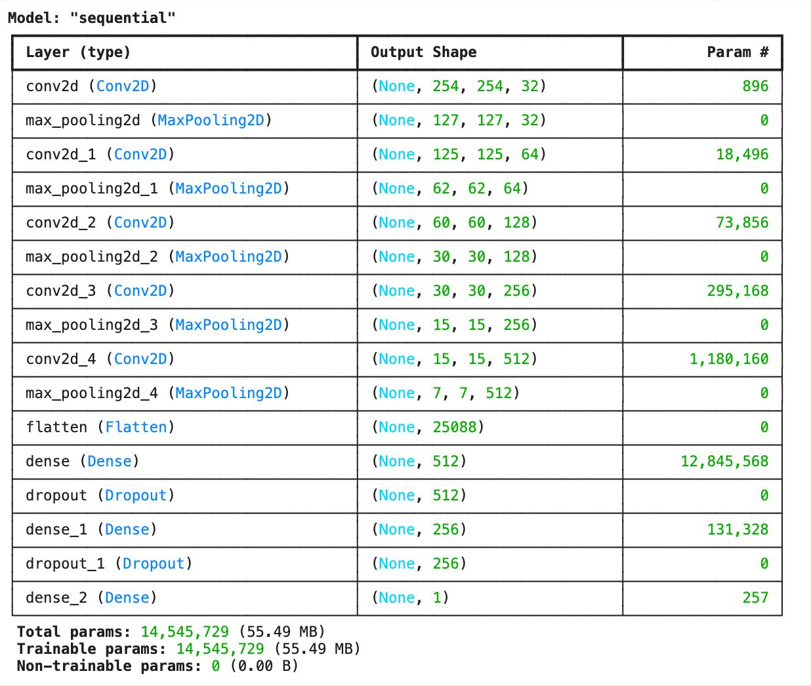
   
   **Optimizer and Loss Function:**
   - **Optimizer:** The model uses the following optimizers:
     - **Adam:** Adaptive moment estimation (default optimizer).
     - **SGD:** Stochastic gradient descent with momentum.
     - **RMSprop:** Optimizer that divides the learning rate by an exponentially decaying average of squared gradients.
     - **Nadam:** A variant of Adam that incorporates Nesterov momentum.
   - **Loss Function:** The binary cross-entropy loss function is used for binary classification tasks.
   - **Metrics:** Accuracy is used as the evaluation metric.

#### **4. Experiment Parameters:**
   Several experiments were conducted with different combinations of hyperparameters to identify the best model configuration. The following parameters were tested:

   - **Learning Rates:**  
     - 0.01, 0.001, 0.0001, 0.00001, 0.002, 0.0005.
   
   - **Optimizers:**
     - **Adam:** Adaptive learning rate based on moment estimates.
     - **SGD:** Stochastic gradient descent with momentum.
     - **RMSprop:** Optimizer that divides the learning rate by an exponentially decaying average of squared gradients.
     - **Nadam:** A variant of Adam with Nesterov momentum.

   - **Batch Size:**
     - 16, 32, 64.
   
   - **Dense Activation Functions:**
     - **ReLU:** Rectified Linear Unit (most commonly used).
     - **Tanh:** Hyperbolic tangent function.
     - **SELU:** Scaled Exponential Linear Unit, often used for deep networks with self-normalizing properties.

   - **Output Activation Functions:**
     - **Sigmoid:** For binary classification, output is between 0 and 1.
     - **Tanh:** For binary classification, output is between -1 and 1.

   - **Kernel Size:**
     - 3x3, 5x5.
   
   - **Number of Layers:**
     - 3, 5, 6 convolutional layers.

#### **5. Model Training and Evaluation:**
   - **Callbacks:**  
     - **EarlyStopping:** Stops training if the validation loss doesn't improve for 10 consecutive epochs, restoring the best weights.
     - **ModelCheckpoint:** Saves the best model (based on validation loss) during training.
   
   - **Training:**  
     The model is trained using the augmented training data, with various combinations of the above hyperparameters. The batch size is set to 16, 32, or 64, and training continues for up to 100 epochs. The training data is passed through the `train_datagen` generator, and the validation data is passed through the `val_datagen` generator.
   
   - **Evaluation:**  
     After training, the model is evaluated on the test set using the `test_datagen` generator to calculate the **test accuracy**.

#### **6. Model Results and Visualization:**
   - **Model Performance:**  
     The results for different experiments are stored, including:
     - Learning rate
     - Optimizer type
     - Activation functions for hidden and output layers
     - Test accuracy
   
   - **Visualization:**  
     The training and validation accuracy and loss are plotted to visualize the learning process and to identify potential overfitting or underfitting.

   - **Sample Predictions:**  
     A function is defined to visualize sample predictions, where the model's predictions on the test set are compared to the actual labels.

#### **7. Model Saving:**
   - The trained model (along with the best weights) is saved in the file `best_model3.h5` for future inference or deployment. The model parameters and experiment results are also saved in a JSON file.


## Hyperparameters and Experiments (CNN)

| Exp | Learning Rate | Batch Size | Optimizer | Dense Activation | Output Activation | Kernel Size | Layers | Test Accuracy |
|-----|---------------|------------|-----------|-------------------|--------------------|-------------|--------|---------------|
| 1   | 0.001         | 32         | adam      | relu              | sigmoid            | 3           | 3      | 0.9280        |
| 2   | 0.0001        | 32         | adam      | relu              | sigmoid            | 3           | 3      | 0.9316        |
| 3   | 0.001         | 64         | adam      | relu              | sigmoid            | 3           | 3      | 0.9365        |
| 4   | 0.001         | 32         | sgd       | relu              | sigmoid            | 3           | 3      | 0.8266        |
| 5   | 0.001         | 32         | adam      | relu              | sigmoid            | 3           | 3      | 0.9438        |
| 6   | 0.0005        | 32         | adam      | relu              | sigmoid            | 3           | 3      | 0.9365        |
| 7   | 0.002         | 32         | adam      | relu              | sigmoid            | 3           | 3      | 0.9328        |
| 8   | 0.001         | 32         | rmsprop   | relu              | sigmoid            | 3           | 3      | 0.9048        |
| 9   | 0.001         | 32         | nadam     | relu              | sigmoid            | 3           | 3      | 0.9512        |
| 10  | 0.001         | 32         | sgd       | relu              | sigmoid            | 3           | 3      | 0.7204        |
| 11  | 0.001         | 32         | adam      | tanh              | sigmoid            | 3           | 3      | 0.9280        |
| 12  | 0.001         | 32         | adam      | selu              | sigmoid            | 3           | 3      | 0.9206        |
| 13  | 0.001         | 32         | adam      | relu              | tanh               | 3           | 3      | 0.5287        |
| 14  | 0.001         | 16         | adam      | relu              | sigmoid            | 3           | 3      | 0.9267        |
| 15  | 0.001         | 64         | adam      | relu              | sigmoid            | 3           | 3      | 0.9438        |
| 16  | 0.01          | 32         | adam      | relu              | sigmoid            | 3           | 5      | 0.5287        |
| 17  | 0.001         | 32         | adam      | relu              | sigmoid            | 3           | 5      | 0.9524        |
| 18  | 0.0001        | 32         | adam      | relu              | sigmoid            | 3           | 5      | 0.9524        |
| 19  | 0.01          | 32         | nadam     | relu              | sigmoid            | 3           | 5      | 0.5287        |
| 20  | 0.001         | 32         | nadam     | relu              | sigmoid            | 3           | 5      | 0.9548        |
| 21  | 0.0001        | 32         | nadam     | relu              | sigmoid            | 3           | 5      | 0.9621        |
| 22  | 0.0001        | 32         | nadam     | relu              | sigmoid            | 3           | 5      | 0.9646        |
| 23  | 1e-05         | 32         | nadam     | relu              | sigmoid            | 3           | 6      | 0.9328        |
| 24  | 0.0001        | 32         | nadam     | relu              | sigmoid            | 3           | 6      | 0.9853        |
| 25  | 0.0001        | 32         | nadam     | relu              | sigmoid            | 5           | 6      | 0.9731        |


### Layer Configuration Reference
- **3-Layer**: 3 Convolutional + 1 Dense 
- **5-Layer**: 5 Convolutional + 2 Dense 
- **6-Layer**: 6 Convolutional + 3 Dense


## Results

### Handcrafted Features and ML Classifiers

#### SVM Classifier
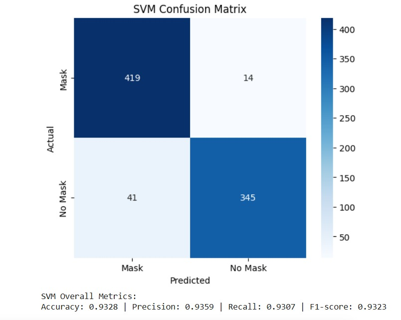
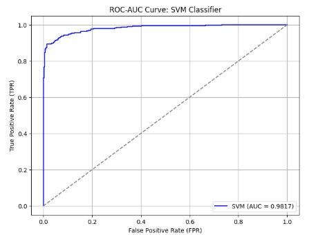

#### Neural Network Classifier
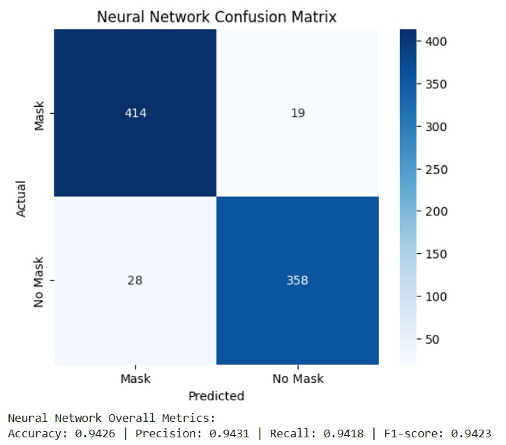
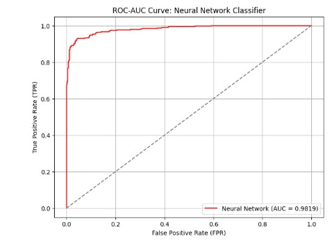

### Deep Learning

#### Convolutional Neural Network Classifier
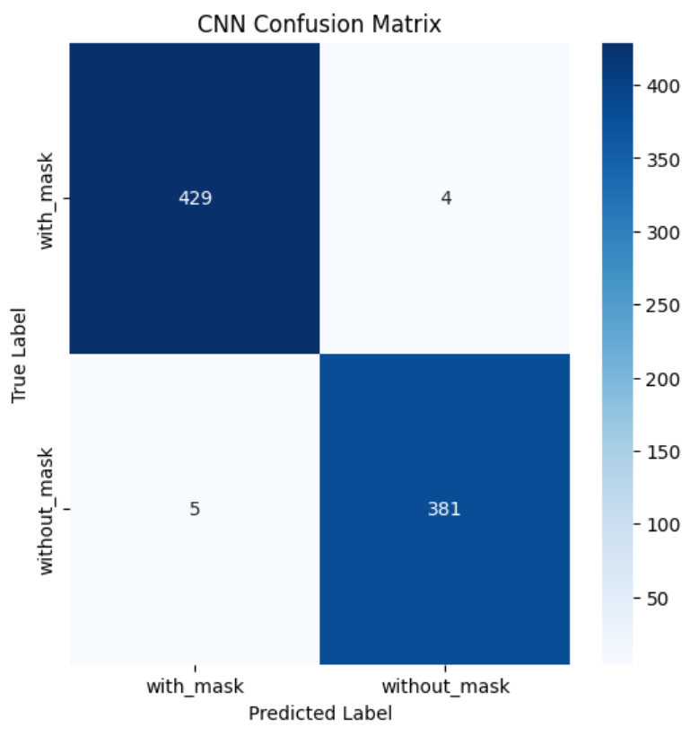
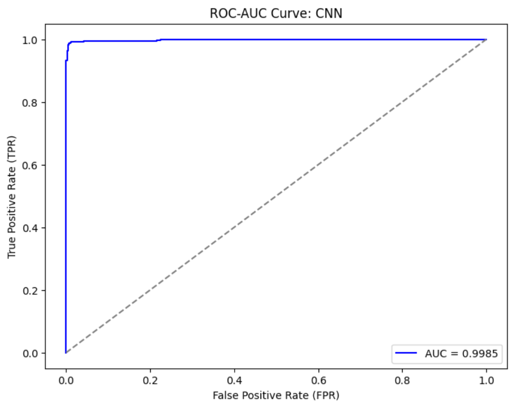

### Inference results
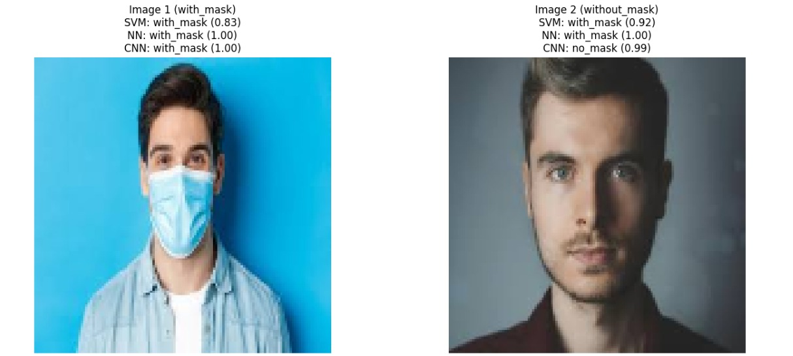

## Observations and Analysis

 - Comparison between results obtained by all the methods:
   
| Model Name      | Accuracy | Precision | Recall | F1-score |
|----------------|----------|-----------|--------|----------|
| SVM            | 0.9328   | 0.9359    | 0.9307 | 0.9323   |
| Neural Network | 0.9426   | 0.9431    | 0.9418 | 0.9423   |
| CNN           | 0.9890   | 0.9885    | 0.9908 | 0.9897   |

- Insights Gained from Results:
  - *Performance Comparison:*  
    CNN achieved the highest performance across all metrics, outperforming both SVM and Neural Networks.  
    Both SVM and Neural Network classifiers provided valuable insights into the classification of masked vs. unmasked faces. The ROC-AUC curves helped visualize the trade-offs between true positive rates and false positive rates.  
  - *Feature Effectiveness:*  
    The combination of multiple handcrafted features (edge density, LBP, HSV histogram, HOG, and skin segmentation) effectively captured both texture and color information. This multimodal feature approach helped the classifiers differentiate between classes, despite potential variations in lighting, pose, or occlusions.  
  - *Impact of Hyperparameter Tuning:*  
    Fine-tuning hyperparameters played a crucial role in boosting model performance. For CNN, architectural choices such as the number of layers and kernels significantly influenced results. For SVM, selecting optimal values for C and gamma was key in improving classification accuracy.  
  - *Importance of Data Preprocessing:*  
    Preprocessing steps such as normalization, augmentation, and color space conversion (between RGB and BGR for compatibility with TensorFlow and OpenCV) were essential for ensuring accurate feature extraction and model learning.  

- Challenges Faced:
  - *Class Imbalance:* Addressed using oversampling and weighted loss functions.  
  - *Overfitting:* Prevented using dropout, batch normalization, and regularization techniques.  
  - *Deciding the Number of Layers in CNN:* Finding the optimal architecture was challenging.  
  - *Data Preprocessing:* Converting images correctly between RGB (used by TensorFlow) and BGR (used by OpenCV) was essential to ensure that the feature extraction functions performed as expected.  
  - *High-Dimensional Data:* The concatenation of various feature types resulted in high-dimensional feature vectors. Normalization was crucial to mitigate scale differences across the different features.  
  - *Hyperparameter Tuning:* For the SVM classifier, selecting appropriate values for C and gamma was challenging. GridSearchCV was used to systematically evaluate combinations of these parameters.  
  - *Model Training:* Training the neural network required careful tuning of the architecture (number of layers and neurons) and training parameters (epochs, batch size) to balance performance and avoid overfitting.  

- Mitigation Strategies: 
  - Applied data augmentation to improve generalization.  
  - Used early stopping to prevent unnecessary training epochs.  
  - Optimized model parameters through systematic hyperparameter tuning.  
  - *CNN Architecture Selection:* Inspired by VGG16, we followed a similar approach by doubling the number of kernels in each layer, which helped in determining the optimal architecture.  
  - *Normalization and Data Augmentation:* Using a StandardScaler ensured that all features contributed equally to the learning process. Additionally, splitting the data into validation sets allowed monitoring of model performance and adjustment of training parameters.  
  - *Systematic Hyperparameter Tuning:* GridSearchCV provided a systematic approach to find the optimal hyperparameters for the SVM, which was critical for achieving good performance.  
  - *ROC-AUC Analysis:* Incorporating ROC-AUC curves for both models helped in understanding the classifiers' ability to distinguish between the classes beyond simple accuracy metrics.


## How to run the code?
To perform inference using classification models, run this ipynb file: [Inference Notebook](Classification/Notebooks/Inference.ipynb)

# Face Mask Segmentation 
#### File Structure
```
VR_Project1/
└── Segmentation/
├── Dataset/
│ ├── with_mask/ # 2165 masked faces images
│ │ ├── masked_1.jpg
│ │ └── ...
│ └── without_mask/ # 1930 unmasked faces images
│ ├── unmasked_1.jpg
│ └── ...
│
├── Images/
│ ├── unetmodelsummary.jpg
│ ├── test2.jpeg
│ ├── data_distribution.png
│ ├── donut_chart.png
│ ├── sample_images.png
│ └── ...
│
├── Models/
│ └── unet_model.h5 # Trained U-Net model
│
└── Notebooks/
├── Traditional_Techniques.ipynb
├── UNet.ipynb
└── CNN.ipynb
```
## Dataset
Sample Images from the dataset:
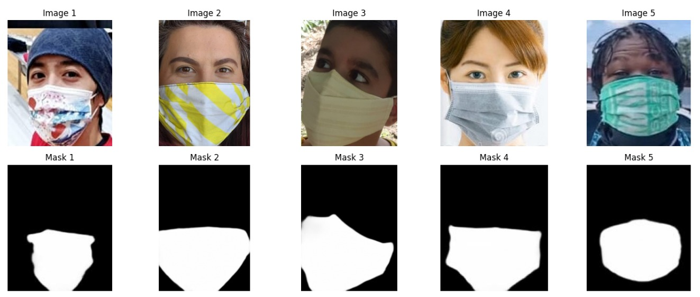

Dataset information:
Our dataset for segmentation includes ground truth face masks. The dataset consists of three types of images:
- **Normal Images**  
- **Cropped Images**  
- **Segmented Images**  

## Dataset Statistics
- **Number of images in `cropped_images_dir`**: 9,452  
- **Number of images in `segmented_images_dir`**: 9,471  

Some images were missing from the dataset, so we mapped the available images. After processing, our final dataset contains **9,382 image pairs**.

#### Source
[](https://github.com/sadjadrz/MFSD) 


## Methodology
#### 1. **Preprocessing Steps:**
 - Before applying segmentation techniques, the following preprocessing steps were performed:
 - Grayscale Conversion: Ensured input images were converted to grayscale where necessary, particularly for thresholding-based methods
 - Noise Reduction: Applied Gaussian blur or median filtering to remove noise, improving segmentation accuracy
 - Contrast Enhancement: Used histogram equalization to enhance contrast in images with poor lighting
 - Normalization: Scaled pixel values to a standard range for consistency across different techniques

#### 2. **Traditional Segmentation Techniques:**
 - Otsu's Thresholding
    - Reason for Use: Provides an automated way to determine an optimal threshold
    - Distinguishing Feature: Calculates an optimal threshold by minimizing intra-class variance
    - Description: Global thresholding technique that automatically determines an optimal threshold to separate foreground and background
    - Advantages: Simple, fast, and computationally efficient
    - Disadvantages: Works poorly when the image has varying illumination or complex backgrounds
    - Performance:
       - Avg IoU: 0.3747
       - Avg Dice: 0.0024
       - Avg Precision: 0.0049
       - Avg Recall: 0.0087
       - Avg F1-Score: 0.0052

 - Adaptive Thresholding
    - Reason for Use: Adapts to local variations in illumination
    - Distinguishing Feature: Applies different thresholds to different parts of the image dynamically
    - Description: Applies different thresholds to different parts of the image based on local pixel intensity variations
    - Advantages: Works better than Otsu on images with non-uniform illumination
    - Disadvantages: Can produce noisy segmentations if not properly tuned
    - Performance:
       - Avg IoU: 0.3327
       - Avg Dice: 0.0022
       - Avg Precision: 0.0043
       - Avg Recall: 0.0075
       - Avg F1-Score: 0.0042

 - Watershed Algorithm
    - Reason for Use: Designed for segmenting overlapping objects
    - Distinguishing Feature: Uses a topographic representation to identify object boundaries
    - Description: A marker-based segmentation algorithm that treats intensity gradients like topographic surfaces
    - Advantages: Useful for segmenting overlapping objects
    - Disadvantages: Sensitive to noise, often requires preprocessing
    - Performance:
       - Avg IoU: 0.2805
       - Avg Dice: 0.0018
       - Avg Precision: 0.0049
       - Avg Recall: 0.0087
       - Avg F1-Score: 0.0059

 - GrabCut Algorithm
    - Reason for Use: Refined foreground-background separation
    - Distinguishing Feature: Iteratively refines segmentation using Graph Cut optimization
    - Description: Iterative segmentation technique based on Graph Cut algorithm, requiring an initial bounding box
    - Advantages: More precise segmentation compared to thresholding techniques
    - Disadvantages: Requires manual initialization and iterative refinement
    - Performance:
        - Avg IoU: 0.3676
        - Avg Dice: 0.0020
        - Avg Precision: 0.0047
        - Avg Recall: 0.0088
        - Avg F1-Score: 0.0056

 - K-Means Clustering
    - Reason for Use: Clustering-based approach for automatic region segmentation
    - Distinguishing Feature: Uses unsupervised learning to group pixels
    - Description: Clustering-based approach that groups pixels into K different clusters based on intensity similarity
    - Advantages: Effective when foreground and background have distinct intensity distributions
    - Disadvantages: Requires predefined number of clusters; not robust to noise
    - Performance:
        - Avg IoU: 0.3216
        - Avg Dice: 0.0027
        - Avg Precision: 0.0040
        - Avg Recall: 0.0064
        - Avg F1-Score: 0.0035


#### 3. **Deep Learning Segmentation (U-Net)**
 - Data Preprocessing
    - Loaded images and corresponding masks
    - Resized images and masks to 256x256 to match model input
    - Normalized images and converted masks to binary values

 - Feature Extraction
    - Extracted features using convolution layers with increasing filter size
    - Applied max-pooling for down-sampling and up-sampling

 - Model Architecture
    - Encoder: Convolution and max-pooling layers
    - Bottleneck: High-dimensional feature extraction
    - Decoder: Transposed convolutions and skip connections
    - Output Layer: Sigmoid activation for binary mask
      U-Net Model Summary](Segmentation/Images/unetmodelsummary.jpg)


## Hyperparameters and Experiments (U-Net)
 - Hyperparameters
   - Input Size: (256, 256, 3)
   - Batch Size: 16
   - Loss Function: Binary Cross-Entropy + Dice Loss
   - Optimizer: Adam (learning_rate=1e-4)
   - Epochs: 50
   - Activation: Sigmoid in output layer
   - Dropout Rate: 0.2 to prevent overfitting

 - Experiments
    - Baseline U-Net with default hyperparameters
    - Reduced learning rate to 1e-5 – improved IoU by 3%
    - Increased batch size to 32 – faster convergence
    - Added data augmentation – boosted performance by 2% Dice


## Results

### Traditional Segmentation Techniques
| Method    | IoU    | Dice Score | Precision | Recall  | F1-Score |
|----------|--------|------------|-----------|---------|----------|
| Otsu     | 0.3747 | 0.0024     | 0.0049    | 0.0087  | 0.0052   |
| Adaptive | 0.3327 | 0.0022     | 0.0043    | 0.0075  | 0.0042   |
| Watershed| 0.2805 | 0.0018     | 0.0049    | 0.0087  | 0.0059   |
| GrabCut  | 0.3676 | 0.0020     | 0.0047    | 0.0088  | 0.0056   |
| K-Means  | 0.3216 | 0.0027     | 0.0040    | 0.0064  | 0.0035   |

### U-Net
| Metric      | Value  |
|------------|--------|
| IoU        | 0.8914 |
| Dice Score | 0.9321 |
| Accuracy   | 96.32% |

### Inference results
#### Traditional Segmentation Techniques
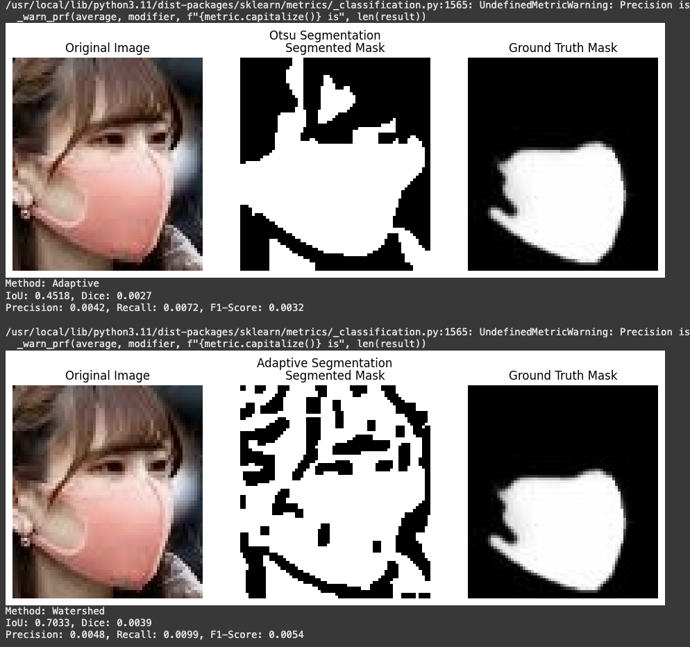
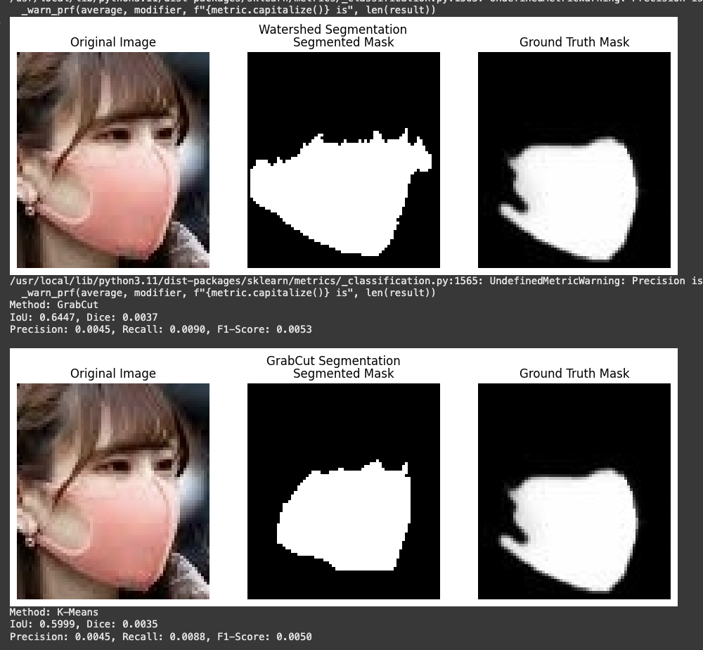
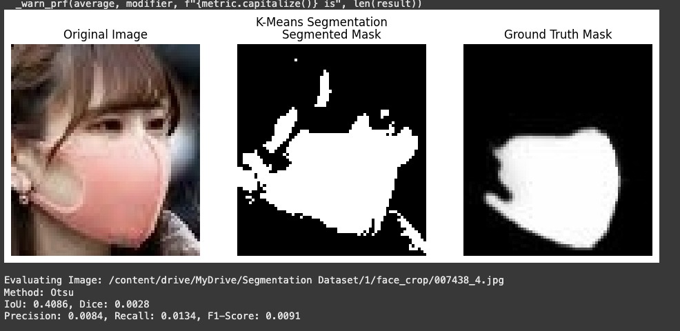
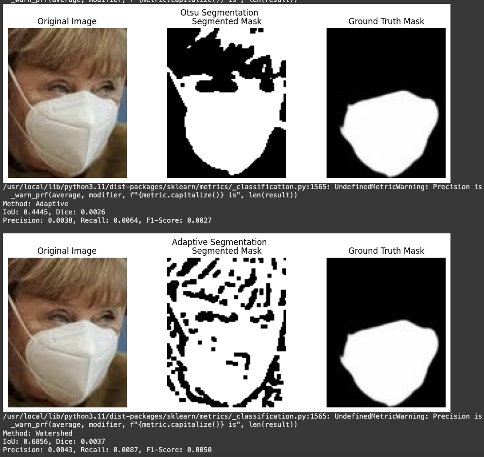
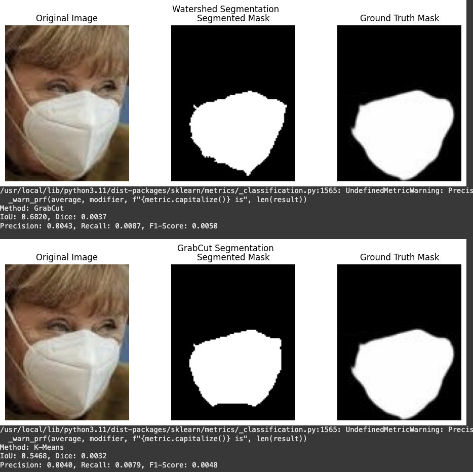
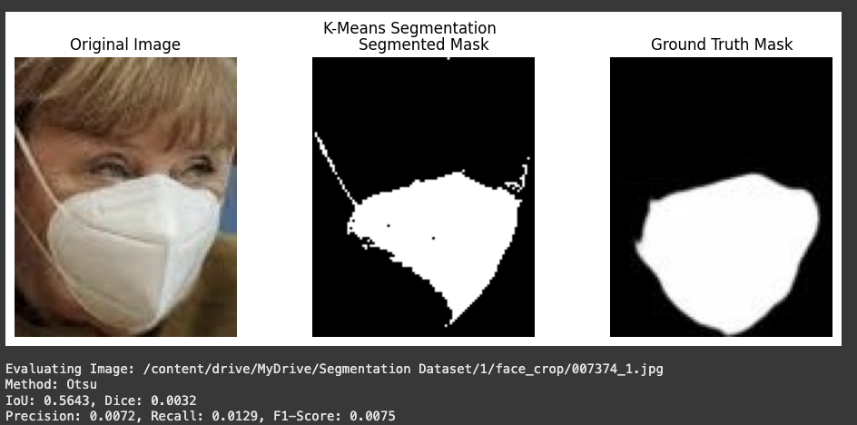
#### U-Net
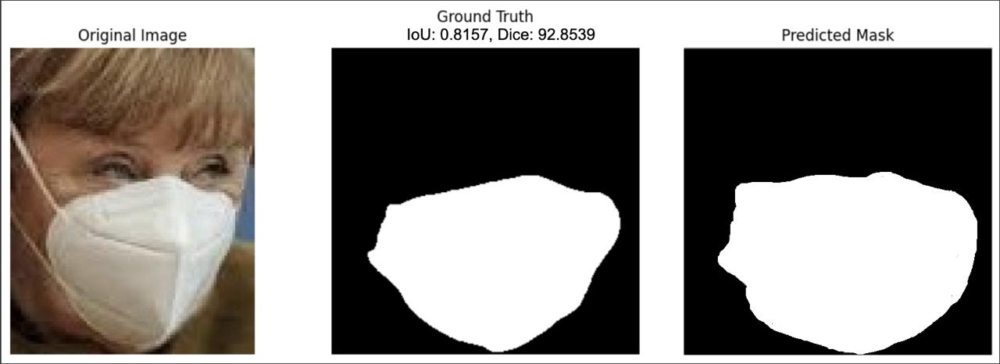
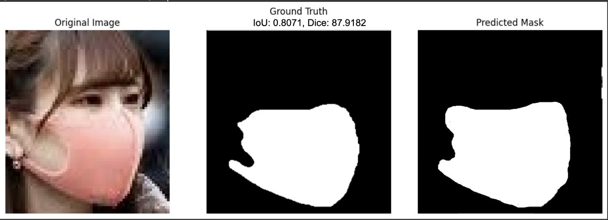


## Observations and Analysis

 - Comparison between results obtained by all the methods:

| Method                | Mean IoU | Mean Dice Score |
|----------------------|---------|----------------|
| Traditional Best (GrabCut) | 0.3676  | 0.0020         |
| U-Net                | 0.865   | 0.9238         |

 - Insights Gained:
    - U-Net significantly outperformed traditional methods
    - Captured fine details and improved IoU/Dice Score
    - Hyperparameter tuning played a crucial role in optimization
    - Data augmentation further improved segmentation results

 - Challenges Faced:
    - Data Imbalance: Addressed by augmenting minority class samples
    - Overfitting: Prevented using dropout and early stopping

 - Mitigation Strategies:
    - Augmented data using image transformations
    - Applied early stopping and regularization
    - Optimized hyperparameters

## How to run the code?
To perform inference using classification models, run this ipynb file: [Inference Notebook](Segmentation/Notebooks/Inference.ipynb)
